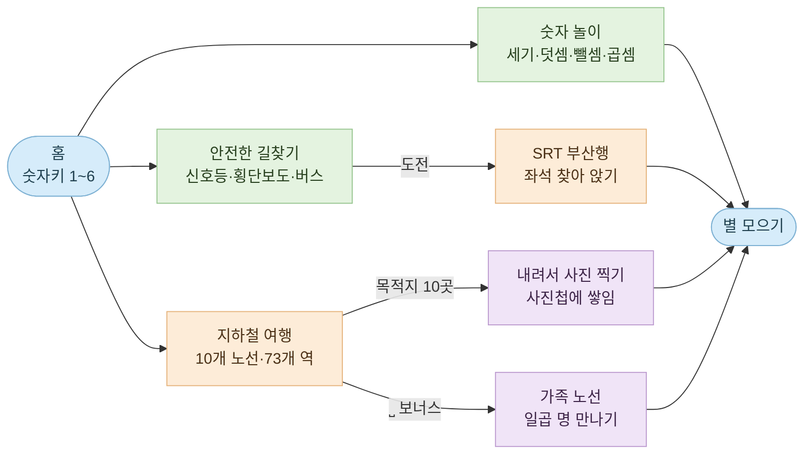

<div align="center">

# 숫자블록 미니게임

**숫자블록 친구들과 세고, 더하고, 길을 찾고, 지하철을 갈아타는 네다섯 살의 첫 웹 게임**

[](#여섯-가지-놀이)
[](#테스트)
[](#어떻게-만들어졌나)
[](#소리와-음성)
[](#지하철-안내방송-정리)
[](https://bliss-forge.github.io/numberblocks-minigame/)

**▶ [지금 놀아보기](https://bliss-forge.github.io/numberblocks-minigame/)**

</div>

> [!IMPORTANT]
> 이 게임은 **네 살에서 여섯 살 아이가 혼자 조작한다**는 전제로 만들어졌습니다.
> 숫자키와 방향키, 스페이스바만으로 전부 조작되고, 틀려도 벌점이나 실패 화면이 없습니다.
> 화면을 고칠 때 이 두 가지는 깨뜨리지 않아야 합니다.

---

## 빠른 시작

빌드도 설치도 없습니다. 정적 파일이라 아무 정적 서버에나 얹으면 됩니다.

```bash
git clone https://github.com/bliss-forge/numberblocks-minigame.git
cd numberblocks-minigame

python3 -m http.server 8000     # 아무 정적 서버나 괜찮습니다
open http://localhost:8000

npm test                        # 테스트 343개
```

`file://` 로 직접 열면 ES 모듈이 막히니 꼭 서버로 띄워 주세요.

---

## 여섯 가지 놀이

홈에서 숫자키 하나로 고릅니다. 카드 번호와 캐릭터 번호는 항상 같습니다.

| 키 | 놀이 | 하는 일 | 캐릭터 |
| --- | --- | --- | --- |
| <kbd>1</kbd> | **몇 개일까?** | 블록을 눈으로 세어 답합니다 | 1 |
| <kbd>2</kbd> | **더하기 합체** | 두 친구를 모아 하나로 만듭니다 | 2 |
| <kbd>3</kbd> | **빼기 블록** | 친구를 덜어내고 남은 수를 셉니다 | 3 |
| <kbd>4</kbd> | **곱하기 블록** | 줄과 칸을 세어 곱을 구합니다 | 4 |
| <kbd>5</kbd> | **안전한 길찾기** | 신호등과 차를 피해 친구를 만나러 갑니다 | 5 |
| <kbd>6</kbd> | **지하철 여행** | 노선을 갈아타며 목적지까지 갑니다 | 6 |

난이도는 <kbd>7</kbd> 쉬움 · <kbd>8</kbd> 차근차근 · <kbd>9</kbd> 도전 세 단계이고, 고른 값은 다음에 켤 때도 남습니다.



### 안전한 길찾기

옆에서 본 동네를 걸어 다니며 신호등을 보고 건너고, 버스를 타고, 친구를 만납니다.
지도는 쉬움·차근차근·도전 세 가지이고, **도전 지도만 SRT 부산행으로 이어집니다** —
수서에서 출발해 동탄·대전·대구를 지나 부산까지, 다섯 칸짜리 열차에서 자기 좌석을 찾아 앉는 여정입니다.

### 지하철 여행

서울 지하철을 옮겨 그린 노선도 위에서 실제로 갈아타며 목적지까지 갑니다.

| | |
| --- | --- |
| 노선 | 10개 (실제 1~9호선 + 가족 노선 10호선) |
| 역 | 73개, 이 중 환승역 27개 |
| 목적지 | 10곳 — 동물원·놀이공원·야구장·경복궁·남산타워·한강공원·하늘공원·어린이대공원·석촌호수·국회의사당 |
| 조작 | 방향키로 걷고, <kbd>Space</kbd>로 타고 내림 |

개찰구를 걸어 지나 계단을 내려가고, 승강장에서 열차를 기다렸다가, 노선도를 보며 내릴 역을 고릅니다.
창밖 풍경은 노선마다 다릅니다 — 1·9호선은 지상, 2·3·4호선은 한강을 건너고, 5~8호선은 지하를 달립니다.
환승역에서는 통로를 걸어 에스컬레이터로 다음 호선에 올라갑니다.
역 이름 안내는 **그 역에 실제로 섰을 때** 나오고, 목적지에서는 도착 멜로디에 이어 발빠짐 주의가 나옵니다.

#### 내릴 때 — 폴짝 뛰기

목적지에 서면 문이 열리고 막대기가 좌우로 움직입니다. 가운데 노란 칸에 왔을 때
<kbd>Space</kbd>를 누르면 승강장 틈을 폴짝 뛰어넘어 내립니다.
세 번 놓치면 네 번째는 그냥 건너가게 해 줍니다 — 이 놀이는 박자를 가르치지,
아이를 열차 안에 가두지 않습니다.

#### 도착해서 — 사진 찍기

내리면 그 장소가 펼쳐집니다. 방향키로 네모 프레임을 옮겨 주인공을 담고
<kbd>Space</kbd>를 누르면 찰칵 — 동물원이면 코끼리, 놀이공원이면 관람차,
야구장이면 전광판입니다. 찍은 곳은 화면 위 **사진첩**에 쌓이고 다음에 켜도 남습니다.

| | |
| --- | --- |
| 조준 | 5×3 칸으로 끊어 움직여 손이 미끄러지지 않습니다 |
| 안내 | 주인공이 어느 쪽인지 매번 알려 줍니다 |
| 벌점 | 없습니다. 세 번 빗나가면 네 번째는 그냥 찍힙니다 |

#### 10호선 가족 노선 — 보너스

서울에 10호선은 없습니다. 도하네 가족이 사는 곳만 한 줄로 이어 놓은 보너스 노선이라
진짜 지하철과 만나는 데가 없고, 목적지 고르는 화면에서 <kbd>Space</kbd>로 들어갑니다.
숫자키 열 개는 목적지가 다 쓰고 있어서 스페이스바를 받았는데, 지하철에서 이미
타고 내릴 때 쓰는 키라 아이에게 새 규칙이 아닙니다.

```
엄마 ─ 아빠 ─ 고양 할아버지 ─ 고양 할머니 ─ 도하 ─ 김해 할아버지 ─ 김해 할머니
```

**조작은 지하철 여행과 하나도 다르지 않습니다.** 개찰구를 걸어 지나고 계단을 내려가
승강장에서 기다렸다 타고, 열차 안을 걸어 다음 역으로 가고, 내릴 때는 같은 폴짝 게임을
합니다. 다른 것은 목적지뿐 — 아직 못 만난 가족이 그때그때 목적지가 되고,
노선도 자리에는 누구를 만났는지 보여 주는 도장판이 들어갑니다.

엄마역에서 출발하니 엄마는 배웅하며 바로 만나고, 나머지 여섯 명을 타고 가서 만납니다.
가운데 **도하역**에서는 도하가 기다립니다. 사진을 보고 앞머리 단발과 웃을 때
반달로 접히는 눈을 옮겨 그렸고, 사진 파일은 저장소에 넣지 않았습니다.

---

## 소리와 음성

| 종류 | 내용 |
| --- | --- |
| 안내 음성 | 한국어 210개 · 영어 200개 (`assets/audio/voice/`) |
| 지하철 안내방송 | 실제 서울 지하철 도착 안내 62개 역 + 발빠짐 주의·출입문 예고·도착 멜로디 |
| 음소거 | 화면 오른쪽 위 **소리** 버튼 하나로 전부 끕니다 |

음성이 없는 역에서는 소리가 조용히 넘어가고 안내 문구만 뜹니다.
실제 역 중에서는 국회의사당 한 곳이 여기에 해당합니다 — 9호선 안내방송 묶음을 아직
구하지 못했습니다. 가족역 일곱 곳은 지어낸 역이라 안내방송을 아예 찾으러 가지 않습니다.

### 지하철 안내방송 정리

내려받은 안내방송 묶음을 `subway_sound/` 아래 게임이 찾는 이름으로 정리해 주는 도구가 있습니다.
CP949로 압축된 zip을 그대로 넣어도 되고, 한 역에 여러 녹음이 있으면 한국어 도착 안내 중 가장 짧은 것을 고릅니다.

```bash
node scripts/import_station_sounds.mjs subway_sound/original_subway_sound            # 미리보기
node scripts/import_station_sounds.mjs subway_sound/original_subway_sound --apply    # 실제 정리
```

출발·행선 안내와 외국어 안내는 도착 음성이 아니라서 걸러내고, 옮길 때 64kbps 모노로 다시 인코딩합니다.
원본을 그대로 넣으려면 `--raw` 를 붙이면 됩니다.

---

## 어떻게 만들어졌나

의존성이 없습니다. 브라우저가 바로 읽는 ES 모듈과 CSS, 그리고 인라인 SVG로 그린 그림뿐입니다.
캐릭터만 미리 렌더한 PNG를 쓰고, 나머지 그림 — 지하철 승강장, 동네 골목, 도착지 열 곳 — 은 전부 코드가 그립니다.

<details>
<summary><b>파일 구성</b></summary>

```
index.html                  홈 카드와 화면 뼈대
styles.css                  홈·게임 전체 시각 스타일
src/
  app.mjs                   게임 상태와 입력 처리
  game-model.mjs            문제 생성과 채점
  audio-manager.mjs         음성·효과음 재생과 음소거
  audio-manifest.mjs        음성 키 목록
  character-*.mjs           숫자블록 캐릭터 배치와 배율
  safety-route-*.mjs        안전한 길찾기 — 지도·이동·신호등·미니맵·그림
  srt-journey*.mjs          SRT 부산행 — 좌석 찾기와 열차 그림
  subway-*.mjs              지하철 여행 — 노선도·여정·장면·역 그림·도착지 그림
  family-line-art.mjs       가족 노선에 나오는 일곱 사람
  photo-hunt.mjs            도착지 사진 찍기와 사진첩
  station-sound-import.mjs  안내방송 파일명 해석
assets/
  characters/               숫자블록 캐릭터 161장
  audio/voice/{ko,en}/      안내 음성
subway_sound/               실제 지하철 안내방송
scripts/                    캐릭터 렌더·음성 생성·안내방송 정리
tests/                      테스트 34개 파일
docs/                       설계 문서와 작업 계획
```

</details>

### 아이가 쓰는 화면이라 지키는 것들

- 숫자키·방향키·스페이스바만으로 전부 조작됩니다. 마우스가 없어도 됩니다.
- 모든 버튼은 최소 44×44px이고 포커스 테두리가 뚜렷합니다.
- `prefers-reduced-motion`을 켜면 깜박임과 흐르는 배경이 멈춥니다.
- 오답에 벌점이 없습니다. 다시 해 보라고만 말합니다.
- PC 1280×720에서 카드 여섯 장이 한눈에 들어오고, 모바일 390×844에서 가로 스크롤이 없습니다.

---

## 테스트

```bash
npm test        # node --test tests/*.test.mjs
```

브라우저 없이 도는 순수 노드 테스트입니다. DOM이 필요한 곳은 가짜 엘리먼트로 대신합니다.
문제 생성과 채점, 안전길 이동과 신호등, 지하철 경로와 환승, 장면 렌더 계약, 홈 카드 계약,
반응형 스타일, 음성 자산 존재 여부까지 **343개**가 확인합니다.

---

## 배포

`main`에 올라가면 GitHub Pages가 그대로 서빙합니다 — 빌드 단계가 없습니다.

**https://bliss-forge.github.io/numberblocks-minigame/**
