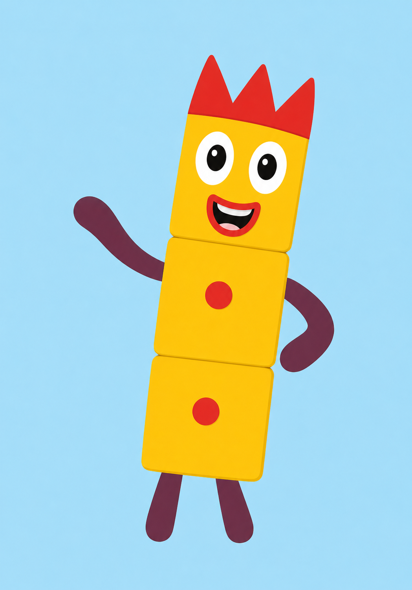

# 숫자블록 놀이터 시각·음향 개선 설계

작성일: 2026-07-20  
상태: 사용자 승인

## 1. 목표

사용자 요청인 “해당 프로젝트에서 소리랑 디자인이 별로다 좀 개선해줘”를 다음 결과로 구체화한다.

- 3~5세가 PC 숫자키만으로 즉시 이해하고 즐길 수 있는 화면을 만든다.
- 캐릭터를 단순한 CSS 도형이 아니라 표정과 자세가 살아 있는 2D 애니메이션 스프라이트로 표현한다.
- 기계적인 브라우저 기본 음성을 자연스러운 한국어와 영국 영어 음성 파일로 교체한다.
- 제공된 Numberblocks 이미지와 사운드는 특징·리듬·활기의 참고 자료로만 사용한다. 원본 이미지, 성우 음성, 사운드보드 클립은 프로젝트에 복제하지 않는다.
- 게임 규칙, 숫자키 조작, 난이도 상승 구조는 유지한다.

## 2. 대상과 제약

- 대상: 3~5세
- 주 입력: PC 숫자키 0~9, `Escape`
- 실행 형태: 설치 없는 단일 웹 게임
- 네트워크: 실제 플레이 중에는 필요하지 않다.
- 접근성: 큰 글자와 명확한 대비를 사용하고, 음소거 상태에서도 문제와 결과를 이해할 수 있어야 한다.
- 범위 제외: 새로운 게임 모드, 계정, 점수 서버, 실시간 TTS 호출, 원작 성우 복제

## 3. 시각 방향

선택안은 **컬러 블록 스튜디오**다.

- 배경은 밝은 하늘, 구름, 초원으로 구성하되 장식은 화면 가장자리에 둔다.
- 시각 계층은 문제 문구 → 캐릭터 → 답 입력의 세 단계로 제한한다.
- 홈 화면의 모드 카드는 이모지 대신 실제 캐릭터 스프라이트와 숫자키 배지를 사용한다.
- 게임 화면은 캐릭터를 중앙 무대에 크게 배치하고, 점수·홈·음소거는 작은 HUD로 묶는다.
- 상시 흔들림과 과도한 회전은 제거한다. 등장, 키 입력, 정답 축하처럼 의미가 있는 순간만 크게 움직인다.
- `prefers-reduced-motion` 환경에서는 이동·회전 애니메이션을 축소한다.

### 캐릭터 원칙

- 1~10의 대표 색과 블록 배열을 유지한다.
- 1의 한쪽 눈, 2의 안경, 3의 왕관과 버튼, 5의 별, 6의 주사위 점, 7의 무지개, 8의 문어 다리, 9의 회색 정사각형, 10의 흰색 격자와 붉은 테두리를 식별 특징으로 사용한다.
- 얼굴은 몸체 상단에 자연스럽게 붙이고, 눈과 입은 작은 화면에서도 읽히도록 키운다.
- 블록은 서로 분리된 카드처럼 보이지 않도록 간격을 좁히고 하나의 유연한 몸처럼 보이게 한다.
- 결과물은 평면 2D 유아용 TV 애니메이션 질감으로 통일한다. 광택이 강한 3D 플라스틱 표현과 두꺼운 외곽선은 피한다.

스타일 기준 이미지:



## 4. 음향 방향

### 음성

- 외부 TTS는 제작 시점에만 사용하고 결과 MP3 파일을 `assets/audio/voice/`에 저장한다.
- 한국어 문제 안내를 먼저 재생하고, 정답 시 한국어 숫자와 영국 영어 숫자를 짧게 이어서 재생한다.
- 원작 성우를 복제하지 않는다. 대신 숫자별로 속도와 높낮이를 조금씩 조정해 독자적인 애니메이션 캐릭터 성격을 만든다.
- 외부 API 키가 없는 현재 환경에서는 `edge-tts`를 제작 도구로 사용한다. 이 도구는 런타임 의존성이 아니며 생성 완료 후 게임 배포물에서 제외한다.
- 동적 문장 수를 줄이기 위해 대사를 다음 범위로 제한한다.
  - 공통 문제 안내: 세기, 더하기, 곱하기 각 1개
  - 숫자 답: 한국어 1~10, 영어 1~10
  - 축하: 4개
  - 재시도: 3개
- 화면에는 실제 수식과 문제 문구를 계속 표시하므로, 음성이 일반화되어도 학습 정보가 손실되지 않는다.

### 효과음

- 원본 사운드보드 클립은 포함하지 않는다.
- 현재 Web Audio 구조를 유지하되 음색과 믹스를 다시 만든다.
  - 키 입력: 매우 짧은 나무 블록 클릭
  - 블록 등장: 낮은 말렛 팝
  - 합체: 두 음이 모여 하나의 안정된 화음으로 끝나는 상승 프레이즈
  - 정답: 1초 이내의 밝은 4음 화음
  - 오답: 위협적이지 않은 낮고 짧은 두 음
- 상시 배경음은 사용하지 않는다. 시작과 정답 순간에만 짧은 음악 신호를 사용해 음성 명료도를 지킨다.
- 전체 출력 레벨은 현재보다 낮추고, 음성 재생 중에는 효과음을 추가로 낮춘다.

## 5. 구성 요소

기존 단일 `index.html` 배포 방식은 유지하되 내부 책임을 다음 단위로 나눈다.

1. `CharacterRenderer`
   - 숫자와 상태를 받아 해당 스프라이트를 배치한다.
   - 등장, 생각, 정답, 오답 상태 클래스를 관리한다.
2. `AudioManager`
   - 음성 큐, 효과음, 음소거, 화면 전환 시 취소를 담당한다.
   - 파일이 없거나 재생이 거부되면 게임을 중단하지 않고 조용히 건너뛴다.
3. `VoiceManifest`
   - 논리적 대사 키와 MP3 경로를 연결한다.
   - 한국어와 영어 재생 순서를 데이터로 정의한다.
4. `GameView`
   - 홈, HUD, 문제, 답 입력, 피드백을 렌더링한다.
5. 기존 게임 상태
   - `home`, `playing`, `celebrating` 상태와 문제 생성 규칙을 유지한다.

파일은 다음처럼 구성한다.

```text
index.html
styles.css
package.json
requirements-voice.txt            # edge-tts==7.2.8 (제작 시점 전용)
assets/
  characters/
    one.png ... ten.png
  audio/
    voice/
      ko/                         # prompt, number-1...10, cheer, retry MP3
      en/                         # number-1...10 MP3
src/
  app.mjs
  app-behavior.mjs
  audio-manager.mjs
  audio-manifest.mjs
  game-model.mjs
scripts/
  generate_voice_pack.py
tests/
  app-behavior.test.mjs
  app-contract.test.mjs
  audio-manager.test.mjs
  character-assets.test.mjs
  game-model.test.mjs
  voice-assets.test.mjs
```

## 6. 데이터 흐름

1. 홈에서 숫자키 1~3을 누르면 오디오 컨텍스트를 열고 해당 모드를 시작한다.
2. 새 문제는 문제 데이터, 캐릭터 번호, 화면 문구, 음성 키를 생성한다.
3. `GameView`가 문제를 그린 뒤 `AudioManager`가 한국어 안내 파일을 재생한다.
4. 숫자키 입력은 답 버퍼와 시각 피드백을 즉시 갱신한다.
5. 정답이면 입력을 잠그고 효과음 → 한국어 답 → 영어 답 순서로 재생한다.
6. 오답이면 버퍼를 지우고 짧은 오답음과 재시도 음성을 재생한다.
7. 홈 이동이나 다음 문제 시작 시 이전 음성 큐와 타이머를 모두 취소한다.

## 7. 오류 처리

- 음성 파일 누락: 콘솔 경고를 한 번만 남기고 자막과 효과음만으로 계속 진행한다.
- 브라우저 자동 재생 제한: 최초 모드 선택 키 입력에서 오디오를 해제한다.
- 오디오 중첩: 새 문제, 홈 이동, 재시도 시 이전 음성 큐를 취소한다.
- 생성 도구 실패: 이미 생성된 파일은 보존하고 실패 목록만 재생성할 수 있게 한다.
- 작은 화면: 캐릭터 크기를 줄이되 얼굴과 답 입력 영역의 최소 크기는 유지한다.
- 느린 장치: 큰 이미지 파일은 WebP 또는 최적화 PNG로 저장하고 시작 화면에서 선로딩한다.

## 8. 검증

자동 검증:

- 1~10 모든 캐릭터 파일이 존재하고 실제로 디코딩된다.
- 음성 매니페스트의 모든 경로가 존재한다.
- 한국어 → 영어 음성 큐 순서와 취소 동작이 맞다.
- 음소거 상태가 화면 이동 후에도 유지된다.
- 숫자키, 넘패드, `Escape` 흐름이 기존처럼 동작한다.
- 정답·오답 상태에서 중복 입력이 발생하지 않는다.

브라우저 검증:

- 1280×720과 1440×900에서 캐릭터, 문제, 답 영역이 겹치지 않는다.
- 1~10 캐릭터의 대표 색, 배열, 소품이 구분된다.
- 음성이 효과음에 묻히지 않고 한국어와 영어 발음이 자연스럽다.
- 홈 → 각 모드 → 정답 → 오답 → 홈 복귀 흐름에서 콘솔 오류가 없다.
- 모션 감소 설정과 음소거 버튼이 동작한다.

## 9. 완료 기준

- 승인된 2D 캐릭터 방향으로 1~10 스프라이트를 적용한다.
- 브라우저 `speechSynthesis`가 기본 경로가 아니며, 내장 음성 파일이 우선 재생된다.
- 제공된 외부 원본 이미지와 음성 클립이 저장소에 포함되지 않는다.
- 기존 세기·더하기·곱하기 게임과 난이도 상승이 유지된다.
- 자동 테스트와 브라우저 검증이 모두 통과한다.
